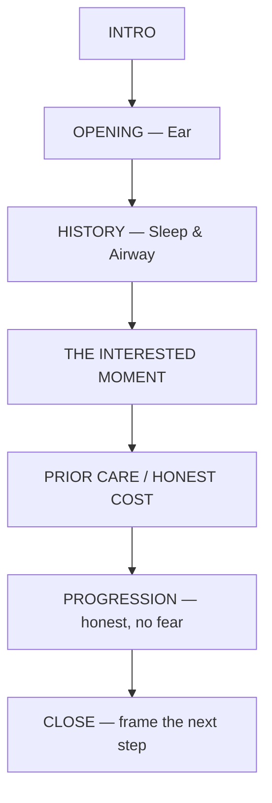
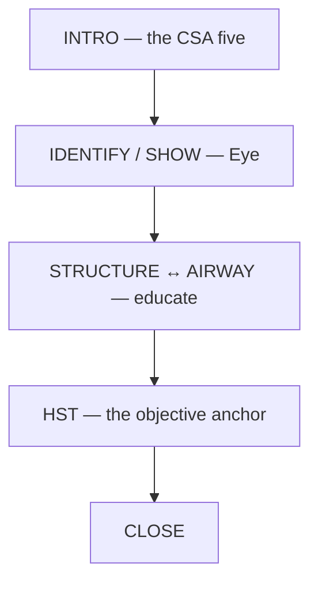
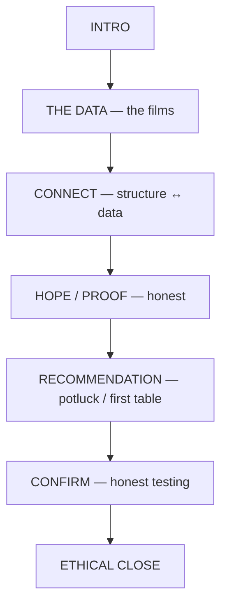

# CSA Patient-Flow Flowcharts

One-page flow maps for the CSA pathway, mirroring the AMC Consultation /
Exam / Report flowcharts (Forms C, F, I). Same guardrails as the scripts:
Consult = Ear, Exam = Eye, Report = Mouth; no cure claims, no fear-selling,
no diagnosing OSA; the physician reads the HST.

The printable one-pager lives beside the scripts in Drive
(`CSA Scripts (Consult · Exam · ROF)` → `CSA Flowcharts`). This file is the
versioned source.

---

## 1 — CSA Consultation Flow (mirrors AMC Form C)

- **INTRO** — Servant handshake · patient's name (up-tone), your name
  (down-tone) · warm comment before sitting · who referred?
- **OPENING (Ear)** — File & pen down, lean in, hands together ·
  "How can I help you today?" · listen, speak half as much · filler words,
  voice inflection, body language throughout.
- **HISTORY — Sleep & Airway** — Snoring? witnessed pauses / gasping? ·
  morning dry mouth / headache · daytime sleepiness (Epworth, plain
  language) · nose vs. mouth breathing · **bed partner — what do they
  hear?**
- **THE INTERESTED MOMENT** — Push the file away · "What does a tired day
  *cost* you?" · serve, don't close · "It isn't really about the snoring,
  is it?"
- **PRIOR CARE / HONEST COST** — Prior study / CPAP / appliance? · did it
  help — still tired? · cost in money *and* years · never "you overspent."
- **PROGRESSION (honest, no fear)** — BP, weight, mood, memory, night
  reflux? · *associations, not verdicts* · "we don't guess — we test" ·
  never predict a heart attack.
- **CLOSE** — 1) can structural airway help? 2) we don't yet know your
  sleep 3) we won't guess 4) Exam + **HST** = objective truth ·
  "Does that sound fair?" · "Follow me."

---

## 2 — CSA Structural Airway Exam Flow (mirrors AMC Form F)

- **INTRO — the Airway & Structure screen (the CSA five)** — Ice-breaker ·
  what we look at: skull-down airway + structure · (1) airway history &
  sleepiness (2) crowded throat / Mallampati (3) tongue scalloping &
  mouth-breathing (4) cranial-postural / forward head posture (5) nasal
  breathing.
- **IDENTIFY / SHOW (Eye)** — Show each finding in their own body ·
  exclamatory only if real · compare to normal · **explain every
  instrument** (pulse-ox, SnoreLab) before use · bed partner into the exam.
- **STRUCTURE ↔ AIRWAY (educate, not frighten)** — Airway chart: show,
  don't scare · crowded awake → more crowded asleep · forward head posture
  narrows the airway · honest associations only.
- **HST — the objective anchor (the "films")** — "I won't guess about your
  sleep" · Home Sleep Test, read by a physician · the X-ray equivalent ·
  (CBCT if indicated) · "Ever had a sleep study?"
- **CLOSE** — Team sets up the device · Report with you + partner ·
  **no treatment or cure promised today** · "A real pleasure — let's get
  your answers" · bring the partner to the Report.

---

## 3 — CSA Report of Findings Flow (mirrors AMC Form I)

- **INTRO** — Review the journey · partner present · permission:
  "soften it or shoot straight?"
- **THE DATA (the "films")** — Teach a normal night first · AHI, oxygen
  dips, fragmentation · **physician's read = the diagnosis (their lane)** ·
  my lane = the structural-airway meaning.
- **CONNECT — structure ↔ data** — Crowded throat, low tongue, forward
  head posture, mouth-breathing · "same story from two directions" ·
  sober risk (association), no fear ladder.
- **HOPE / PROOF (honest)** — Real example, before/after · "I can't
  promise you the same result" · "I can promise honest effort and a real
  pathway."
- **RECOMMENDATION — potluck / first table** — CSA = the **first table**
  (early structural airway care) · free to use the other tables by real
  need (sleep MD, dentist, ENT, CPAP) · free to pass a dish by · no
  pressure either way.
- **CONFIRM — honest testing** — Orthopedic / postural / airway
  confirmation to back up the findings, not theater.
- **ETHICAL CLOSE** — Clear plan: what, cost, time — nothing hidden ·
  team handles the investment, unpressured · patient interest over the
  sale · partner as support · next step.
